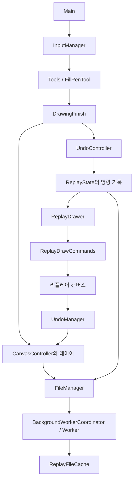

# src 구조 및 소스 코드 리뷰

검토일: 2026-09-28 · 기준: `638c432`의 작업 디렉터리

`src`의 ActionScript 파일 76개를 대상으로 구조·선언·참조를 조사하고, 입력 → 그리기 → Undo/리플레이 및 저장·불러오기 경로를 중점 추적했다. 기존 미커밋 변경인 `src/Modules/Tools/LassoTool.as`도 현재 내용으로 검토했으며 수정하지 않았다. 이번 작업은 검토 문서만 추가한다.

## 1. 판정 기준과 검증 범위

- **문제 채택 기준:** 현재 코드로 도달 가능한 호출 경로와 구체적인 실패 조건이 있어야 한다. 일반적인 예외 가능성이나 코딩 스타일만으로 버그를 판정하지 않았다.
- **반증:** 각 항목에서 정상 동작 조건을 먼저 확인했다. 조건에 따라 문제가 사라지면 그 조건을 명시하고, 해당 조건까지 실패한다고 확대하지 않았다.
- **검증 수준:** `정적 경로`는 호출·상태 변경을 코드로 확인했다는 뜻이다. `AIR 분리 검증`은 원본 메서드 또는 해당 연산을 별도 프로그램에서 실행한 결과이며, 실제 앱 UI 전체를 자동 조작한 결과는 아니다.
- **성능:** 불필요한 연산·할당은 확인했지만 실제 지연 시간이나 FPS 개선율은 측정하지 않았다. 영구 메모리 누수와 GC 전까지의 불필요한 메모리 점유를 구분했다.
- **데드 코드:** 이벤트 등록, 함수 객체 전달, 문자열 참조를 포함해 확인했다. `describeType`/임베디드 SWF로 연결되는 public UI 필드는 단순 참조 횟수만으로 제거 대상으로 삼지 않았다.
- 전체 파일에 대한 구조·참조 조사와 주요 경로 정밀 검토이며, 모든 입력 조합과 모든 UI 동작의 무결성을 보증하는 전수 실행 검사는 아니다.

### 검증 결과

| 검증 | 결과 |
|---|---|
| Main 컴파일 | AIR SDK 51.3.4, `strict=true`, `warnings=true`로 성공. 오류·경고 출력 없음 |
| Worker 컴파일 | 같은 옵션으로 성공. 오류·경고 출력 없음 |
| 배경색 Undo 경로 | 원본 `ReplayState`와 원본 `UndoController.addContinue()`를 사용한 분리 검증에서 기록 손실 확인. UI 갱신만 stub 처리 |
| 확장자 변환 | 원본 메서드를 분리 실행하여 대문자 확장자 오변환 확인 |
| 비트맵 경계 조건 | 0픽셀 축에서 `Error #2015`, 픽셀 길이/저장 크기 불일치에서 `Error #2030` 확인 |
| 캔버스 관통 선분 | 양 끝이 캔버스 밖이어도 AIR 렌더링 결과에 실제 픽셀이 생기는 것 확인 |
| 손상된 리플레이 압축 블록 | 헤더·최종 이미지 미리보기는 성공하고 명령 블록 압축 해제는 `Error #2058`로 실패하는 입력 확인 |

빌드와 분리 검증 산출물은 `%TEMP%/fofopaint-gpt6astra-review`에 생성했다. 앱의 실제 작업 데이터와 배포용 SWF는 변경하지 않았다. 아래 제안 코드는 리뷰용이며 프로젝트에 적용하거나 통합 테스트한 패치가 아니다. 새 helper가 필요한 경우 별도로 표시했다.

## 2. 구조 분석

| 영역 | 주요 파일 | 역할과 연결 |
|---|---|---|
| 진입·초기화 | `Main.as` | 각 컨트롤러에 Main을 연결하고 캔버스, UI, Worker, 저장 상태, 입력 순서로 초기화 |
| 입력·도구 선택 | `InputManager`, `ToolController`, `DragInteraction` | 전역 입력과 모드별 이벤트를 관리하고 도구 실행을 분기 |
| 그리기 | `CanvasController`, `Tools/*`, `FillPenTool`, `DrawingFinish` | 임시 Shape/BitmapData에 그린 뒤 실제 레이어에 반영 |
| Undo 기록 | `UndoManager`, `UndoController`, `ReplayState` | 명령 버퍼를 묶음으로 저장. 최근 10묶음은 메모리에, 오래된 묶음은 파일에 기록 |
| 재생·복원 | `ReplayController`, `ReplayDrawer`, `ReplayDrawCommands`, `ReplayFileCache` | 명령 실행, 프레임 탐색, 디스크/메모리 이미지 캐시, Deep Undo |
| 입출력 | `FileManager`, `BackgroundWorkerCoordinator`, `worker/BackgroundImageProcessor`, `ReplayDataCodec` | 이미지 병합, PNG 인코딩, 리플레이 압축 및 파일 저장 |
| UI·상태 저장 | `MainUI*`, `Symbols/*`, `AppStateManager`, `AppStateVars` | 표시 객체, 환경설정, 작업 복원. UI 일부는 SWF와 reflection으로 연결 |
| 캡처·보조 기능 | `CaptureController`, `CaptureArea`, `CaptureStamp`, `ReferenceLayerController`, `ImageViewWindow` | 캡처 영역·스탬프·참고 이미지·보조 창 |



주요 상태는 정적 필드로 공유된다. 특히 `undoDataIndex`와 배열의 마지막 원소, 저장 요청 시점과 Worker 완료 시점은 서로 다른 개념이다. 아래 문제들은 이 차이를 혼용하는 경로에서 주로 발생한다. 우선 해당 경계를 고치는 것이 대규모 클래스 분리보다 직접적인 효과가 있다.

## 3. 기능 문제

P1은 저장·복구 데이터 손실 가능성이 있는 우선 수정 항목, P2는 특정 조작이나 입력에서 발생하는 기능 오류다.

| ID | 우선순위 | 문제 | 핵심 발생 조건 |
|---|---|---|---|
| B1 | P1 | 저장 픽셀과 크기·배경·참고 이미지 정보의 시점 불일치 | 저장 요청 후 압축 완료 전에 캔버스 크기 등의 상태 변경 |
| B2 | P1 | 새 파일 검증 전에 현재 리플레이 파일을 비움 | 미리보기는 정상이고 압축 명령 데이터만 손상된 `.2020` 불러오기 |
| B3 | P1 | ‘저장 후 불러오기’에서 저장 취소/실패에도 불러오기 실행 | 해당 메뉴 선택 후 저장 대화상자 취소 또는 오류 |
| B4 | P2 | Undo 후 배경색 변경이 기록에 남지 않음 | 현재 기록은 bgColor, 되돌린 뒤쪽 기록은 단일 명령 |
| B5 | P2 | Worker 시작 대기 중 종료하면 저장 대기를 생략 | Worker가 STOPPED → INIT인 짧은 구간에 창 닫기 |
| B6 | P2 | 축소 결과 한 축이 0이 되어 BitmapData 생성 실패 | 가늘고 긴 이미지 불러오기 또는 스탬프 색 추출 |
| B7 | P2 | 캔버스를 가로지른 펜 선이 확정 시 사라짐 | 입력 샘플은 모두 캔버스 밖, 샘플 사이 선분만 내부 통과 |
| B8 | P2 | 대문자 확장자를 잘못 잘라 저장 이름 변경 | `.JPG`, `.JPEG`, `.PNG`로 저장 이름 지정 |

### B1. 저장 요청과 완료 시점의 메타데이터가 섞임

**근거:** [FileManager.as:1147](E:/fofopaint-source/src/Modules/FileManager.as:1147), [FileManager.as:1201](E:/fofopaint-source/src/Modules/FileManager.as:1201), [BackgroundWorkerCoordinator.as:81](E:/fofopaint-source/src/Modules/BackgroundWorkerCoordinator.as:81), [ReplayFileCache.as:56](E:/fofopaint-source/src/Modules/ReplayEngine/ReplayFileCache.as:56), [ReplayFileCache.as:75](E:/fofopaint-source/src/Modules/ReplayEngine/ReplayFileCache.as:75).

**발생 경로:**

1. 600×390 캔버스에서 저장한다. `saveFOFOFile()`은 이 크기의 레이어 픽셀을 ByteArray로 복사한다.
2. Worker가 압축하는 동안 Ctrl을 누르고 캔버스 경계를 드래그하여 700×390으로 늘린다.
3. 입력 경로의 [InputManager.as:1525](E:/fofopaint-source/src/Modules/InputManager.as:1525), [InputManager.as:2326](E:/fofopaint-source/src/Modules/InputManager.as:2326), [CanvasController.as:1460](E:/fofopaint-source/src/Modules/CanvasController.as:1460)는 `isSaveInProgress`를 검사하지 않는다. 크기 변경은 [CanvasController.as:1062](E:/fofopaint-source/src/Modules/CanvasController.as:1062)에서 반영된다.
4. Worker 완료 후 `writeReplayFile()`은 **현재** `CANVAS_WIDTH/HEIGHT`를 읽어 `rFinalImage`에 기록한다. 픽셀은 600×390이고 메타데이터는 700×390이다.
5. 다시 열 때 [FileManager.as:695](E:/fofopaint-source/src/Modules/FileManager.as:695)의 `setPixels()`가 필요한 바이트를 다 읽지 못한다. 미리보기 생성부터 실패할 수 있다.

**반증:** 저장 완료까지 관련 상태가 바뀌지 않으면 정상이다. 저장 중 그리기를 허용하는 것 자체는 오류가 아니다. 문제가 되는 것은 같은 저장 묶음에서 서로 다른 시점의 값을 사용한다는 점이다. 상단 파일 버튼 비활성화는 캔버스 크기 변경 입력까지 막지 않는다. [MainUIController.as:65](E:/fofopaint-source/src/Modules/MainUIController.as:65)의 팝업 검사에도 저장 상태는 없다.

**AIR 분리 검증:** 936,000바이트(600×390×4)를 700×390 비트맵에 `setPixels`하면 `Error #2030`이 발생했다. UI에서 저장과 리사이즈를 경쟁시키는 전체 시나리오는 실행하지 않았다.

**수정 제안:** 픽셀을 복사할 때 파일에 기록할 모든 스칼라 값을 함께 고정한다. 첫 이미지 크기·배경·미러, 최종 이미지 크기·배경, 참고 이미지 크기·위치·회전·스케일·알파, 저장 경로가 포함되어야 한다.

```actionscript
// FileManager: 픽셀 복사 직전에 구성해 해당 저장 요청과 함께 보관.
const saveMeta:Object = {
    finalWidth: CanvasController.CANVAS_WIDTH,
    finalHeight: CanvasController.CANVAS_HEIGHT,
    finalBG: CanvasController.CANVAS_BG_COLOR,
    firstWidth: ReplayFileCache.rFirstImageLayer1BitmapData.width,
    firstHeight: ReplayFileCache.rFirstImageLayer1BitmapData.height
    // 첫 이미지 색/미러, 참고 이미지 변환, 경로도 같은 시점에 복사.
};

// writeReplayFile에 해당 요청의 saveMeta를 전달하도록 시그니처 변경.
fs.writeObject(["rFinalImage", dataB, dataB1,
    saveMeta.finalWidth, saveMeta.finalHeight, saveMeta.finalBG]);
```

위 코드는 연결 지점을 보여 주는 부분 제안이다. 완료 콜백까지 요청별 메타데이터를 유지해야 하며, 단순히 완료 시점에 `saveMeta`를 새로 만들면 해결되지 않는다. 수정 후 저장 중 크기·배경·참고 이미지 변환을 각각 바꾸고 저장된 PNG와 `.2020`의 동일 시점 여부를 확인한다.

### B2. 새 파일의 압축 데이터가 손상되면 현재 리플레이 기록까지 잃음

**근거:** [FileManager.as:175](E:/fofopaint-source/src/Modules/FileManager.as:175), [FileManager.as:189](E:/fofopaint-source/src/Modules/FileManager.as:189), [FileManager.as:214](E:/fofopaint-source/src/Modules/FileManager.as:214), [ReplayFileCache.as:36](E:/fofopaint-source/src/Modules/ReplayEngine/ReplayFileCache.as:36).

`loadFOFOFile()`은 `initializeReplayDataFile(true)`로 현재 `repdata`를 WRITE 모드로 열어 비운 **후에** 새 파일의 압축 데이터를 `uncompress()`/`decode()`한다. 예외 시 원래 파일을 복구하는 처리가 없다.

**구체적인 입력 조건:** `FOFOPAINT` 헤더와 압축 블록 길이, 뒤쪽 `rFinalImage`는 정상인데 압축 명령 블록만 손상된 파일이다. 미리보기 함수는 [FileManager.as:663](E:/fofopaint-source/src/Modules/FileManager.as:663)에서 압축 블록을 건너뛰므로 이런 파일도 미리보기가 가능하다. 사용자가 불러오기를 선택하면 현재 디스크 리플레이 기록이 먼저 지워지고 새 파일의 압축 해제에서 예외가 난다.

**영향:** 캔버스가 당장 지워지는 것으로 한정할 수는 없다. 확실한 손실은 기존 `repdata`에 있던 오래된 기록/Deep Undo 데이터다. 이후 저장·재생·Undo가 현재 이미지와 일치하지 않을 수 있다. 전역 오류 처리 [Main.as:241](E:/fofopaint-source/src/Main.as:241)는 로그·힌트 처리이며 복구 트랜잭션은 아니다.

**반증:** 정상 파일은 끝까지 읽혀 현재 데이터 교체가 완료된다. 미리보기 단계에서 이미 거절되는 손상 파일도 이 경로에 들어오지 않는다. 따라서 ‘모든 잘못된 파일을 드롭하면 기존 작업이 지워진다’고 판단하지 않았다.

**AIR 분리 검증:** 원본 `getFinalBitmapDataFrom2020File()`과 `isNew2020File()`로 2×2 미리보기 및 헤더 승인 성공을 확인했다. 같은 파일의 압축 명령 블록은 `uncompress()`에서 `Error #2058`을 발생시켰다. 기존 작업 파일을 실제로 비우는 전체 로딩 함수는 실행하지 않았으며, 그 순서는 위 소스에서 확인했다.

**수정 제안:** 파싱·압축 해제·레이어 크기/바이트 수 검증을 기존 작업과 분리한 임시 상태에 먼저 완료하고, 성공한 결과만 실제 상태에 반영한다. 다음은 새 helper 구현이 필요한 구조 제안이다.

```actionscript
public static function loadFOFOFile(oldFile:File):void
{
    var loaded:Object;
    try
    {
        // 기존 repdata / imagecache / 화면 상태를 변경하지 않는 함수.
        loaded = readAndValidateFOFOFile(oldFile);
    }
    catch (error:Error)
    {
        showLoadFaildMouseHint();
        return;
    }

    // 별도 임시 파일에 기록 완료 후 교체. 교체 실패 시 이전 파일 보존.
    commitValidatedFOFOFile(loaded);
}
```

핵심은 `uncompress()`에 catch만 추가하는 것이 아니라, 그 전에 기존 파일을 비우지 않는 것이다. 정상 미리보기와 손상 압축 블록을 가진 파일을 테스트하고, 실패 전후 기존 `repdata` 내용이 동일한지 확인한다.

### B3. 저장 취소/오류가 불러오기 또는 업데이트 진행으로 처리됨

**근거:** [FileManager.as:584](E:/fofopaint-source/src/Modules/FileManager.as:584), [FileManager.as:1458](E:/fofopaint-source/src/Modules/FileManager.as:1458), [FileManager.as:1526](E:/fofopaint-source/src/Modules/FileManager.as:1526), [FileManager.as:1537](E:/fofopaint-source/src/Modules/FileManager.as:1537).

**발생 경로:** 다른 파일 미리보기 → ‘저장 후 불러오기’ → `isLoadPendingAfterSaving=true` → 저장 대화상자에서 취소 → `Event.CANCEL`의 `onErrorEvent()` → `loadFileTo("canvas")`. 저장되지 않은 기존 작업을 다른 파일로 바꾸는 동작이다. `IOErrorEvent.IO_ERROR`도 같은 처리다. 연속 저장 오류용 `onErrorSaveFileContinue()`에도 불러오기 분기가 있다. 업데이트 대기 상태에서는 취소 시 `AppUpdater.startUpdate()`를 실행한다.

**반증:** 저장이 정상 완료된 뒤 불러오기/업데이트를 진행하는 경로는 정상이다. 처음부터 ‘저장하지 않고 불러오기’를 선택한 경우도 문제로 보지 않는다. 여기서의 결함은 ‘저장 후 진행’을 선택한 흐름에서 **성공하지 않은 저장**을 진행 조건으로 취급한다는 점이다.

**수정 제안:** 취소/실패에서는 대기 작업을 취소하고 현재 작업을 유지한다. 성공한 저장 완료 경로에서만 다음 작업을 실행한다.

```actionscript
function onErrorEvent(e:Event):void
{
    setFileBrowserIsOpen(false);
    removeEvent(); // 원본 closure의 SELECT/CANCEL/IO_ERROR 해제
    file.cancel();
    isLoadPendingAfterSaving = false;
    AppUpdater.isUpdatePendingAfterSaving = false;
    closeLoadMenuBox();
    if (e.type === IOErrorEvent.IO_ERROR)
        MainUI.showMouseHintTemp("Save failed");
}
```

`onErrorSaveFileContinue()`의 `loadFileTo()` 분기도 같은 원칙으로 제거해야 한다. 성공 판정은 압축 완료뿐 아니라 PNG와 리플레이 파일 쓰기 완료까지 포함해야 한다. 취소, 쓰기 오류, 정상 저장을 각각 구분해 확인한다.

### B4. Undo 후 배경색 변경 시 현재 기록 대신 삭제 예정 기록을 수정

**근거:** [ColorPickerController.as:480](E:/fofopaint-source/src/Modules/ColorPickerController.as:480), [ReplayState.as:99](E:/fofopaint-source/src/Modules/ReplayEngine/ReplayState.as:99), [ReplayState.as:119](E:/fofopaint-source/src/Modules/ReplayEngine/ReplayState.as:119), [ReplayState.as:187](E:/fofopaint-source/src/Modules/ReplayEngine/ReplayState.as:187), [UndoController.as:88](E:/fofopaint-source/src/Modules/UndoController.as:88).

**발생 경로:** 배경색 빨강 변경 → 캔버스 크기 변경 → Undo로 크기 변경 취소 → 배경색 파랑 변경.

`hasLastRMemoryDataCommand()`는 `undoDataIndex`의 묶음을 검사하지만, `updateLastRMemoryDataCommand()`는 배열의 마지막 묶음을 수정한다. 마지막 묶음이 `canvasSize`처럼 단일 명령이면 이를 파랑 bgColor로 바꾸고 버퍼를 비운다. 이어지는 `addContinue()`가 그 뒤쪽 묶음을 `splice()`로 삭제한다. 화면은 파랑인데 기록은 빨강인 상태가 남는다.

**AIR 분리 검증 결과:**

```text
입력 기록: [ [["bgColor", 0xFF0000]], [["canvasSize", ...]] ]
undoDataIndex=0, isDeleteUndoDataPending=true
addUndoBGColorData(0x0000FF)
기대: 현재 기록의 최종 배경색 = 255
실제: [ [["bgColor", 16711680]] ]  // 빨강이 그대로 남음
```

**반증 성공 범위:** Undo하지 않아 현재 index가 마지막이면 정상이다. 뒤쪽 묶음이 bgColor 없는 여러 명령의 스트로크이면 버퍼가 남아 `addContinue()`가 정상 반영하는 경우도 분리 검증했다. 따라서 ‘Undo 후 모든 배경 변경’으로 일반화하지 않는다.

**수정 제안:** 검사한 묶음과 수정할 묶음을 동일한 index로 지정한다. `updateLastRMemoryDataCommand()`를 다음 형태로 바꾼다.

```actionscript
private static function updateLastRMemoryDataCommand(command:String):void
{
    const index:int = UndoManager.undoDataIndex;
    if (index < 0 || index >= rMemoryData.length)
        return;

    const arr:Array = rMemoryData[index];
    for (var i:int = 0; i < arr.length; i++)
    {
        if (arr[i][0] === command)
        {
            arr[i] = rMemoryDataBuffer[0].concat();
            rMemoryDataBuffer = [];
            rMemoryDataFrame[index] = arr.length;
            return;
        }
    }
}
```

이 수정은 뒤쪽 기록 삭제를 기존 `addContinue()`에 맡기면서 현재 묶음만 수정한다. 확인 항목은 단일 명령 뒤쪽 기록, 다중 명령 뒤쪽 기록, 미러 명령 포함, 저장 후 재생의 배경색이다.

### B5. Worker INIT 상태가 종료 대기 대상에서 빠짐

**근거:** [BackgroundWorkerCoordinator.as:61](E:/fofopaint-source/src/Modules/BackgroundWorkerCoordinator.as:61), [BackgroundWorkerCoordinator.as:112](E:/fofopaint-source/src/Modules/BackgroundWorkerCoordinator.as:112), [BackgroundWorkerCoordinator.as:124](E:/fofopaint-source/src/Modules/BackgroundWorkerCoordinator.as:124), [BackgroundWorkerCoordinator.as:192](E:/fofopaint-source/src/Modules/BackgroundWorkerCoordinator.as:192), [FileManager.as:1730](E:/fofopaint-source/src/Modules/FileManager.as:1730).

Worker가 꺼져 있을 때 저장을 요청하면 작업은 `workerFunctionsBeforeStart`에 들어가고 상태가 INIT이 된다. Worker가 running이 된 뒤에도 11회의 프레임 검사를 거쳐 RUNNING으로 바뀐다. 이때까지 `isWorkerRunning()`은 false다.

이 구간에 창을 닫으면 `onWindowClosingEvent()`가 작업 대기 분기를 건너뛰고 `checkWindowMaximizedAndSaveAllData()`로 진행한다. 특히 최대화하지 않은 창은 [FileManager.as:1633](E:/fofopaint-source/src/Modules/FileManager.as:1633)에서 바로 닫힌다. 앱 내부 작업 복원 데이터 저장과 사용자가 요청한 PNG/`.2020` 저장은 별도 작업이므로, 전자가 실행되어도 후자의 완료를 보장하지 않는다.

**반증:** Worker가 이미 RUNNING이면 기존 대기 코드가 동작한다. 모든 창 종료가 실패하는 것은 아니다. INIT 구간과 아직 실행되지 않은 큐가 핵심 조건이다.

**수정 제안:** Worker의 실행 상태가 아니라 남은 작업 유무를 검사한다.

```actionscript
// BackgroundWorkerCoordinator 내부에 추가
public static function hasPendingWork():Boolean
{
    return workerState !== WORKER_STATE_STOPPED
        || workerFunctionsBeforeStart.length > 0
        || workerDataSendCount !== workerDataReceiveCount
        || captureImageDataQueue !== null
        || undoDataQueue !== null
        || receivedSaveImageDataFromWorker !== null;
}

// FileManager의 종료 분기 및 대기 완료 조건
if (BackgroundWorkerCoordinator.hasPendingWork())
{
    // 기존 대기 타이머를 등록.
    // 타이머 안에서도 !hasPendingWork()일 때만 종료.
}
```

Worker 시작 실패 시에는 단순 무한 대기가 되지 않도록 실패 상태를 별도로 처리해야 한다. 이 항목은 정상 시작 중인 INIT만으로도 성립한다.

### B6. 긴 이미지 축소 시 0픽셀 축 생성

**근거:** [FileManager.as:408](E:/fofopaint-source/src/Modules/FileManager.as:408), [CaptureStamp.as:330](E:/fofopaint-source/src/Modules/CaptureStamp.as:330), [CaptureStamp.as:860](E:/fofopaint-source/src/Modules/CaptureStamp.as:860).

**경로 A:** 4000×1 PNG → `validateImageFile()` 성공 → `loadImageFile()` → `finalizeLoadFile()`. 최대 크기 2000에 맞춰 배율 0.5를 적용하고 양 축을 `Math.floor()`하면 2000×0이 된다. `new BitmapData(2000, 0, ...)`에서 `ArgumentError #2015`가 발생한다.

**경로 B:** 가로 1000·세로 5 등 얇은 캔버스에서 스탬프를 켜고, 배경색이 전용 팔레트에 없는 색이면 `getCaptureAreaBmpd()`로 지배색을 계산한다. 긴 축을 100으로 줄이면 100×0.5가 되고 BitmapData의 정수 높이는 0이다. 전체 폭은 300 이상이므로 `CaptureStamp.update()`의 폭 검사만으로는 이 경로가 차단되지 않는다.

**반증:** 축소 후 두 축이 모두 1 이상인 보통 이미지는 정상이다. 스탬프를 끄거나 전용 팔레트 색 분기를 사용하는 경우 경로 B는 실행되지 않는다.

**수정 제안:** 두 위치 모두 결과 축을 최소 1로 제한한다.

```actionscript
const limitedImageWidth:int = Math.max(1, Math.floor(width * scaleLimitMultiplier));
const limitedImageHeight:int = Math.max(1, Math.floor(height * scaleLimitMultiplier));

// CaptureStamp.getCaptureAreaBmpd에서도 같은 원칙
const scaledWidth:int = Math.max(1, Math.floor(areaWidth * scale));
const scaledHeight:int = Math.max(1, Math.floor(areaHeight * scale));
```

가로/세로가 뒤집힌 입력도 함께 확인한다. 하한 제한은 상위 입력이 정상적인 양수 이미지라는 현재 호출 조건에 대한 수정이다.

### B7. 펜의 샘플 지점 검사만으로 실제 그려진 선을 버림

**근거:** [Utils.as:23](E:/fofopaint-source/src/Modules/Utils.as:23), [InputManager.as:2399](E:/fofopaint-source/src/Modules/InputManager.as:2399), [PenTool.as:91](E:/fofopaint-source/src/Modules/Tools/PenTool.as:91), [PenTool.as:171](E:/fofopaint-source/src/Modules/Tools/PenTool.as:171), [PenTool.as:234](E:/fofopaint-source/src/Modules/Tools/PenTool.as:234), [DrawingFinish.as:19](E:/fofopaint-source/src/Modules/DrawingFinish.as:19).

**조건:** 작은 캔버스를 화면 중앙에 놓고 손떨림 보정을 끈 둥근 펜으로 빠르게 관통한다. 캔버스 기준 시작점 (-10, 50), 다음 입력 샘플 (110, 50), 캔버스 100×100, 두께 3인 경우다. `isCursorInDrawArea()`는 상단·사이드 UI 영역을 제외할 뿐 실제 캔버스 내부 여부를 검사하지 않으므로 시작 자체가 가능하다.

두 샘플의 브러시 원은 모두 캔버스 밖이어서 `canAddUndoData`가 켜지지 않는다. 하지만 `graphics.lineTo()`는 두 점 사이를 그리므로 캔버스 내부에 선이 생긴다. MouseUp에서 `DrawingFinish.run()`이 false 플래그를 보고 Shape와 기록을 지워 선이 사라진다.

**AIR 분리 검증:** 위 선분을 100×100 비트맵에 그렸을 때 비투명 영역이 `(x=0, y=49, w=100, h=3)`이었다. 실제 마우스 이벤트 누락 빈도는 측정하지 않았으며, 전체 펜 이벤트를 자동 재현한 검증은 아니다.

**반증:** 샘플 중 하나라도 캔버스/브러시와 교차하면 기존 플래그가 true가 되어 정상이다. 캔버스 안에서 시작하는 일반 스트로크도 이 문제가 없다. 따라서 ‘빠른 펜 입력은 항상 사라진다’는 주장은 제외한다.

**수정 제안:** 직전 실제 그리기 좌표부터 새 좌표까지의 선분도 검사해야 한다. 단순 bounding-box 교차만 쓰면 대각선의 오탐이 생기므로 정확한 선분-사각형 검사 helper를 사용한다. 다음은 통합 위치를 나타내는 부분 코드다.

```actionscript
// PenTool.handleMouseMove: 좌표 보정 후, 실제 lineTo 직전에 검사.
// prevDrawX/Y는 마지막 lineTo/moveTo에 전달한 좌표로 관리.
if (!UndoManager.canAddUndoData &&
    strokeSegmentIntersectsCanvas(prevDrawX, prevDrawY, mx, my,
        xSize, xShape, CanvasController.CANVAS_WIDTH, CanvasController.CANVAS_HEIGHT))
{
    UndoManager.canAddUndoData = true;
}
CanvasController.canvasDrawLayerChild.graphics.lineTo(mx, my);
prevDrawX = mx;
prevDrawY = my;
```

`strokeSegmentIntersectsCanvas`는 새로 구현할 helper다. [LineTool.as:48](E:/fofopaint-source/src/Modules/Tools/LineTool.as:48)의 두꺼운 선분 경계 검사와 내부 점 검사를 재사용할 수 있으나, 펜의 사각 끝 모양·확장 끝점·에어브러시 범위까지 맞춘 뒤 사용해야 한다. 둥근 펜/지우개의 관통 사례부터 회귀 검증한다.

### B8. 확장자 검사와 잘라내기에 서로 다른 대소문자 기준 사용

**근거:** [FileManager.as:1338](E:/fofopaint-source/src/Modules/FileManager.as:1338), [FileManager.as:1558](E:/fofopaint-source/src/Modules/FileManager.as:1558).

`convertToPNGFilePath()`는 `name.toLowerCase().lastIndexOf(...)`로 검사하고 `name.lastIndexOf(...)`로 잘라낸다. 대문자 확장자에서는 두 번째 index가 -1이 된다. AIR의 실제 실행 결과는 다음과 같다.

| 입력 | 실제 출력 파일명 |
|---|---|
| `picture.JPG` | `picture.JP.png` |
| `picture.JPEG` | `picture.JPE.png` |
| `picture.PNG` | `picture.PNG.png` |
| `picture.jpg` | `picture.png` |

또한 `extArr`에 5개 항목이 있지만 반복은 `i < 3`이어서 GIF/JFIF 처리는 도달하지 않는다. WebP도 목록에 없다. 확장자를 문자열 중간에서 검색하는 방식은 `picture.jpg.backup`처럼 마지막 확장자가 다른 이름도 잘라낸다.

**반증:** 소문자 `.jpg`, `.jpeg`, `.2020`와 소문자 `.png`의 일반 경로는 정상이다. 디렉터리 이름을 자르는 문제로 확대하지 않는다. 실제 탐색 대상은 `getFileNameFromPath()`로 얻은 파일명이다.

**수정 제안:** 마지막 확장자만 대소문자 무시로 치환한다.

```actionscript
private static function convertToPNGFilePath(path:String):String
{
    var name:String = getFileNameFromPath(path);
    const directory:String = getDirectoryOnly(path);
    const ext:RegExp = /\.(2020|jpg|jpeg|gif|jfif|webp|png)$/i;
    name = ext.test(name) ? name.replace(ext, ".png") : name + ".png";
    return directory.length > 0 ? directory + File.separator + name : name;
}
```

## 4. 성능·중복 처리 검토

### PERF1. 저장 시 새로 병합한 BitmapData를 다시 clone

**출처:** [FileManager.as:1453](E:/fofopaint-source/src/Modules/FileManager.as:1453), [FileManager.as:1502](E:/fofopaint-source/src/Modules/FileManager.as:1502), [FileManager.as:1561](E:/fofopaint-source/src/Modules/FileManager.as:1561), [BackgroundWorkerCoordinator.as:247](E:/fofopaint-source/src/Modules/BackgroundWorkerCoordinator.as:247).

`getMergedBitmapdtata()`가 저장 전용 비트맵을 새로 만들고, 저장 선택 뒤 이를 다시 `clone()`하여 Worker 전송 함수에 넘긴다. 전송 함수는 받은 비트맵을 바이트로 복사한 후 dispose한다. 원래 `mergedImage`는 그 이후 사용하지 않는다.

2000×2000이면 clone 한 번에 원시 픽셀 기준 약 15.3 MiB가 추가된다. 원본 mergedImage의 명시적인 dispose도 없어 GC에 회수를 맡긴다. 영구 누수로 단정하지 않는다.

**반증:** Worker가 메인 캔버스 객체를 dispose하는 것을 피하려는 복제는 필요할 수 있다. 그러나 여기서는 이미 저장 전용으로 새로 만든 병합 결과이므로 추가 clone의 보호 대상이 없다. 대화상자 표시 동안 스냅샷을 보존하는 기존 동작도 직접 전달로 유지된다.

```actionscript
// mergedImage를 const 대신 var로 보유하고 Worker로 소유권을 넘긴다.
BackgroundWorkerCoordinator.startPngEncodingWorker(
    mergedImage, CanvasController.CANVAS_BG_COLOR, false, false);
mergedImage = null;

// 취소·조기 return 경로에서는 아직 소유한 임시 비트맵을 해제한다.
if (mergedImage !== null)
{
    mergedImage.dispose();
    mergedImage = null;
}
```

위 dispose를 성공 경로에 그대로 연속 삽입하면 안 된다. Worker 시작 대기 closure가 사용할 객체는 Worker 측만 dispose해야 한다. 저장 취소, 다른 이름 저장, 연속 저장 각각의 소유권 경로를 수정해야 한다.

### PERF2. 캐시 이미지를 복사한 직후 다시 크기 변경용 복사 수행

**출처:** [ReplayDrawer.as:209](E:/fofopaint-source/src/Modules/ReplayEngine/ReplayDrawer.as:209), [ReplayDrawer.as:469](E:/fofopaint-source/src/Modules/ReplayEngine/ReplayDrawer.as:469), [CanvasController.as:100](E:/fofopaint-source/src/Modules/CanvasController.as:100).

`drawCacheImageFirst()`는 캐시의 두 레이어를 `updateBitmapData()`로 clone한 뒤 `updateCanvasSizeReplayMode()`를 호출한다. 캐시의 크기가 이전 리플레이 크기와 다르면 후자가 두 레이어를 다시 할당하고 방금 clone한 이미지를 draw한 뒤 clone을 dispose한다. 새 크기의 이미지가 이미 준비되어 있는데 다시 같은 크기로 복사한다.

**반증:** 크기가 같으면 `updateCanvasSizeReplayMode()`가 즉시 반환하므로 이 중복 작업이 없다. `canvasSize` 명령을 재생할 때 기존 이미지를 새 크기에 옮기는 작업은 필요한 동작이다. 모든 호출에서 복사를 제거하면 안 된다.

**제안:** 캐시 적용 후에는 레이어 픽셀을 건드리지 않고 표시 크기와 임시 그리기 버퍼만 갱신하는 경로를 사용한다. [CanvasController.as:797](E:/fofopaint-source/src/Modules/CanvasController.as:797)의 draw-mode 동기화 함수가 유사한 구조다. 아래는 새 helper의 핵심 부분이며 패널·커서·뷰포트 갱신도 함께 옮겨야 한다.

```actionscript
// 새 레이어 bitmapData가 이미 w/h 크기로 연결된 경우에만 호출.
const previousDrawBuffer:BitmapData = rCanvasDrawLayerBitmapData;
rCanvasDrawLayerBitmapData = new BitmapData(w, h, true, 0);
rCanvasDrawLayerBitmap.bitmapData = rCanvasDrawLayerBitmapData;
if (previousDrawBuffer !== null)
    previousDrawBuffer.dispose();
ReplayState.RCANVAS_WIDTH = w;
ReplayState.RCANVAS_HEIGHT = h;
rCanvasPanel.scrollRect = new Rectangle(0, 0, w, h);
// panel 배경, rFollowMouse bounds, viewport fitting도 기존 함수와 동일하게 갱신.
```

크기가 다른 캐시 사이를 왕복 탐색하는 경우로 확인한다. 시간 개선량은 별도 프로파일링 대상이다.

### PERF3. 스탬프 색 추출을 위해 큰 이미지 전체를 병합한 뒤 최대 100픽셀로 축소

**출처:** [CaptureStamp.as:302](E:/fofopaint-source/src/Modules/CaptureStamp.as:302), [CaptureStamp.as:341](E:/fofopaint-source/src/Modules/CaptureStamp.as:341), [CanvasController.as:644](E:/fofopaint-source/src/Modules/CanvasController.as:644).

색 추출용 결과는 긴 축이 최대 100인데, `getMergedBitmapdtata()`는 전체 캔버스/캡처 영역 크기의 비트맵을 생성한다. 이후 작은 비트맵에 draw하고 큰 임시 비트맵을 dispose한다. 전체 2000×2000 캡처라면 작은 색 샘플을 만들기 위해 약 15.3 MiB의 임시 픽셀 버퍼와 전체 크기 합성을 수행한다.

**반증:** [CaptureStamp.as:860](E:/fofopaint-source/src/Modules/CaptureStamp.as:860)의 캐시 조건 덕분에 모든 프레임에서 실행되지는 않는다. 작은 이미지와 전용 팔레트 배경색 경로에서는 영향이 작거나 없다.

**제안:** 병합 함수에 출력 배율을 추가하여 처음부터 작은 비트맵에 각 레이어를 합성한다. 레이어 순서·배경·리플레이의 임시 스트로크 포함 규칙은 기존 병합 함수에 유지해야 한다.

```actionscript
// getMergedBitmapdtata에 outputScale:Number = 1.0을 추가하는 경우의 핵심.
const sourceW:Number = clipRect ? clipRect.width : xBitmapData1.width;
const sourceH:Number = clipRect ? clipRect.height : xBitmapData1.height;
bmpd = new BitmapData(
    Math.max(1, Math.floor(sourceW * outputScale)),
    Math.max(1, Math.floor(sourceH * outputScale)), true,
    transparentBG ? 0 : 0xFF000000 | xBGCOLOR);
mat = new Matrix(outputScale, 0, 0, outputScale,
    clipRect ? -clipRect.x * outputScale : 0,
    clipRect ? -clipRect.y * outputScale : 0);
// 이후 레이어 draw에는 이 mat을 그대로 사용.
```

작은 해상도에서 레이어별 합성을 하면 기존 ‘전체 합성 후 축소’와 반투명 경계의 반올림 결과가 조금 달라질 수 있다. 색 샘플 용도로 허용 가능한지 결과를 비교한 뒤 적용한다. 정확한 픽셀 동일성이 요구되면 기존 경로를 유지한다.

### 중복 메서드: 성능 문제와 유지보수 문제를 분리

| 위치 | 관찰 | 권장 |
|---|---|---|
| [Global.as:204](E:/fofopaint-source/src/Global.as:204), [Global.as:228](E:/fofopaint-source/src/Global.as:228) | `getScaleIndex()`와 `getUIScaleIndex()`가 같은 필드 반환. 둘 다 호출됨 | 이름 하나로 호출을 통일할 수 있지만 실행 성능 문제로는 채택하지 않음 |
| [Global.as:117](E:/fofopaint-source/src/Global.as:117), [Global.as:193](E:/fofopaint-source/src/Global.as:193) | 힌트 강조색 getter 본문 동일, private 쪽은 미사용 | 미사용 private getter 삭제 |
| [FillPenTool.as:132](E:/fofopaint-source/src/Modules/FillPenTool.as:132), [LineTool.as:210](E:/fofopaint-source/src/Modules/Tools/LineTool.as:210) | `inputMoveToData()` 본문 동일 | 서로 다른 도구의 독립 버퍼이므로 전역 상태까지 합치지 말 것. 필요하면 버퍼를 인자로 받는 helper로만 공통화 |
| `Symbols/*`의 `setScale()` | 두 축에 배율을 넣는 짧은 구현 반복 | 일부는 `constScale` 보정이 있어 완전 동일 의미가 아님. 성능 결함 없음 |

### 파일 스트림 정리 개선

[FileManager.as:727](E:/fofopaint-source/src/Modules/FileManager.as:727)의 `isNew2020File()`은 헤더 불일치 시 닫은 스트림을 744행에서 다시 열고 닫지 않은 채 false를 반환한다. `isOld2020File()`의 761/763행 조기 반환에도 close가 없다. 명시적 자원 정리 누락은 확인되지만, GC 시점에 따라 달라지는 파일 잠금 지속이나 실제 사용자의 실패는 검증하지 않았으므로 위 기능 버그 8건에 포함하지 않았다.

재open을 제거하고 모든 경로를 finally에서 닫으면 된다.

```actionscript
public static function isNew2020File(file:File):Boolean
{
    if (!file) return false;
    const fs:FileStream = new FileStream();
    var opened:Boolean = false;
    try
    {
        fs.open(file, FileMode.READ);
        opened = true;
        return fs.bytesAvailable >= 9 && fs.readUTFBytes(9) === "FOFOPAINT";
    }
    catch (error:Error) { return false; }
    finally { if (opened) fs.close(); }
}
```

## 5. 데드 코드

### 판정 방법

주석은 제외하고 문자열은 보존한 상태에서 선언 식별자를 전 `src/**/*.as`에서 검색했다. 아래 확정 목록은 선언 외 참조가 없는 **private 메서드 33개와 private 필드 29개**다. 이벤트 리스너에 전달되거나 함수 객체로 보관된 메서드는 참조로 계산했다. reflection은 public 표시 필드 연결에 사용되며 아래 private 항목의 사용 근거가 되지 않는다.

이는 확정 가능한 부분집합이다. 다른 미사용 함수에서만 호출되는 메서드, 값을 쓰기만 하는 필드, 같은 이름이 여러 클래스에 있는 멤버까지 전부 판정한 목록은 아니다.

| 종류 | 파일 | 선언 위치 |
|---|---|---|
| 메서드 | `src/Global.as` | [applyToolBoxButtonOverFGColor:188](E:/fofopaint-source/src/Global.as:188), [getHintHighlightBoxColor:193](E:/fofopaint-source/src/Global.as:193), [hexToRGBHSVVector:343](E:/fofopaint-source/src/Global.as:343) |
| 메서드 | `src/HintStrings.as` | [getOpacityButtonHintString:292](E:/fofopaint-source/src/HintStrings.as:292), [getSizeButtonHintString:302](E:/fofopaint-source/src/HintStrings.as:302) |
| 필드 | `src/Modules/AboutBoxController.as` | [driveUsageCalculationId:27](E:/fofopaint-source/src/Modules/AboutBoxController.as:27) |
| 필드 | `src/Modules/BackgroundWorkerCoordinator.as` | [isSaveInProgressOFFDelayTimer:38](E:/fofopaint-source/src/Modules/BackgroundWorkerCoordinator.as:38) |
| 메서드 | `src/Modules/CaptureController.as` | [updateCanvasFlipOnCaptureMode:159](E:/fofopaint-source/src/Modules/CaptureController.as:159) |
| 필드 | `src/Modules/CaptureStamp.as` | [captureStampRect:31](E:/fofopaint-source/src/Modules/CaptureStamp.as:31), [defaultBmpdHeight:34](E:/fofopaint-source/src/Modules/CaptureStamp.as:34), [captureStampDominantColorRefBmpd:39](E:/fofopaint-source/src/Modules/CaptureStamp.as:39) |
| 메서드 | `src/Modules/CaptureStamp.as` | [getTextWidthMain:250](E:/fofopaint-source/src/Modules/CaptureStamp.as:250) |
| 메서드 | `src/Modules/FileManager.as` | [getJumpImageFolder:550](E:/fofopaint-source/src/Modules/FileManager.as:550), [isImageFileExt:789](E:/fofopaint-source/src/Modules/FileManager.as:789), [removeLastFileSeparator:1358](E:/fofopaint-source/src/Modules/FileManager.as:1358) |
| 필드 | `src/Modules/FillPenTool.as` | [canvasDrawZIndexSave:44](E:/fofopaint-source/src/Modules/FillPenTool.as:44) |
| 메서드 | `src/Modules/ImageViewWindow.as` | [setCanvasWindowVisible:61](E:/fofopaint-source/src/Modules/ImageViewWindow.as:61) |
| 메서드 | `src/Modules/SidebarController.as` | [sidebarOFFRightMouseDownEvent:434](E:/fofopaint-source/src/Modules/SidebarController.as:434) |
| 메서드 | `src/Modules/ToolController.as` | [isDrawingToolSelected:172](E:/fofopaint-source/src/Modules/ToolController.as:172) |
| 필드 | `src/Symbols/CanvasNavigatorBoxSet.as` | [navCursorOffsetX:25](E:/fofopaint-source/src/Symbols/CanvasNavigatorBoxSet.as:25), [navCursorOffsetY:26](E:/fofopaint-source/src/Symbols/CanvasNavigatorBoxSet.as:26) |
| 필드 | `src/Symbols/ColorPickerSet.as` | [angles:60](E:/fofopaint-source/src/Symbols/ColorPickerSet.as:60), [lastMixColor:61](E:/fofopaint-source/src/Symbols/ColorPickerSet.as:61), [lastMixAlpha:62](E:/fofopaint-source/src/Symbols/ColorPickerSet.as:62), [rotateCount:63](E:/fofopaint-source/src/Symbols/ColorPickerSet.as:63) |
| 메서드 | `src/Symbols/ColorPickerSet.as` | [getFirstRGBInfoColorText:193](E:/fofopaint-source/src/Symbols/ColorPickerSet.as:193), [updateFirstRGBInfoColorText:198](E:/fofopaint-source/src/Symbols/ColorPickerSet.as:198), [setRGBInfoTextColor:282](E:/fofopaint-source/src/Symbols/ColorPickerSet.as:282) |
| 필드 | `src/Symbols/EyedropperLensSet.as` | [deafultZoom:15](E:/fofopaint-source/src/Symbols/EyedropperLensSet.as:15), [lastColor:23](E:/fofopaint-source/src/Symbols/EyedropperLensSet.as:23), [offTimer:24](E:/fofopaint-source/src/Symbols/EyedropperLensSet.as:24) |
| 메서드 | `src/Symbols/EyedropperLensSet.as` | [pickedConfirmColorEffectMouseMoveEvent:77](E:/fofopaint-source/src/Symbols/EyedropperLensSet.as:77) |
| 메서드 | `src/Symbols/FOFO.as` | [isTopPos:25](E:/fofopaint-source/src/Symbols/FOFO.as:25) |
| 메서드 | `src/Symbols/HintBoxSet.as` | [getText:35](E:/fofopaint-source/src/Symbols/HintBoxSet.as:35), [getDefaultHeight:50](E:/fofopaint-source/src/Symbols/HintBoxSet.as:50), [getScaledHeight:64](E:/fofopaint-source/src/Symbols/HintBoxSet.as:64) |
| 메서드 | `src/Symbols/SeekBarSet.as` | [increaseReplayPrograssBarWidth:54](E:/fofopaint-source/src/Symbols/SeekBarSet.as:54), [getReplayPrograssBarWidth:88](E:/fofopaint-source/src/Symbols/SeekBarSet.as:88), [setReplayDeleteBarVisibleOFF:274](E:/fofopaint-source/src/Symbols/SeekBarSet.as:274) |
| 메서드 | `src/Symbols/SidePanelSet.as` | [setTempVisibleOFF:42](E:/fofopaint-source/src/Symbols/SidePanelSet.as:42), [setTempVisibleON:57](E:/fofopaint-source/src/Symbols/SidePanelSet.as:57) |
| 필드 | `src/Symbols/ToolMenuSet.as` | [base:43](E:/fofopaint-source/src/Symbols/ToolMenuSet.as:43), [iconLeft:44](E:/fofopaint-source/src/Symbols/ToolMenuSet.as:44), [defaultColor:47](E:/fofopaint-source/src/Symbols/ToolMenuSet.as:47) |
| 메서드 | `src/Symbols/ToolMenuSet.as` | [bgBoxVisible:190](E:/fofopaint-source/src/Symbols/ToolMenuSet.as:190), [checkBottomOFF:218](E:/fofopaint-source/src/Symbols/ToolMenuSet.as:218) |
| 필드 | `src/Symbols/ToolOptionsSet.as` | [layerVisibleBackup:60](E:/fofopaint-source/src/Symbols/ToolOptionsSet.as:60) |
| 메서드 | `src/Symbols/ToolOptionsSet.as` | [isLayerCheckButtonsDisabled:119](E:/fofopaint-source/src/Symbols/ToolOptionsSet.as:119) |
| 필드 | `src/Symbols/TopMenuSet.as` | [hintOKBGColor:95](E:/fofopaint-source/src/Symbols/TopMenuSet.as:95), [hintFontColor:96](E:/fofopaint-source/src/Symbols/TopMenuSet.as:96), [isHintLocked:102](E:/fofopaint-source/src/Symbols/TopMenuSet.as:102), [hintWaitAnimTimer:103](E:/fofopaint-source/src/Symbols/TopMenuSet.as:103), [hintWaitAnimCount:104](E:/fofopaint-source/src/Symbols/TopMenuSet.as:104), [newWindowIconStateSaveLayerButton:106](E:/fofopaint-source/src/Symbols/TopMenuSet.as:106), [newWindowIconStateDrawModeIcon:107](E:/fofopaint-source/src/Symbols/TopMenuSet.as:107), [cpatureInputStringSave:113](E:/fofopaint-source/src/Symbols/TopMenuSet.as:113) |
| 메서드 | `src/Symbols/TopMenuSet.as` | [getCaptureInputFinalHeight:130](E:/fofopaint-source/src/Symbols/TopMenuSet.as:130), [setCaptureInputString:140](E:/fofopaint-source/src/Symbols/TopMenuSet.as:140), [getCaptureInputFinalString:145](E:/fofopaint-source/src/Symbols/TopMenuSet.as:145) |
| 메서드 | `src/Modules/ReplayEngine/ReplayController.as` | [restoreZoomReplayMode:1603](E:/fofopaint-source/src/Modules/ReplayEngine/ReplayController.as:1603) |
| 필드 | `src/Modules/ReplayEngine/ReplayState.as` | [REPLAY_FASTEST_TOTAL_TIME:8](E:/fofopaint-source/src/Modules/ReplayEngine/ReplayState.as:8) |
| 필드 | `src/Modules/Tools/DottedLineTool.as` | [lastLineLength:9](E:/fofopaint-source/src/Modules/Tools/DottedLineTool.as:9) |

**수정 방식:** 위 private 선언/메서드를 제거한다. 현재 필드 초기화식은 단순 값·계산·기하 객체 생성 등이며, 외부 등록을 실행하는 초기화는 확인되지 않았다. 관련 import는 다른 사용이 남는지 확인한 뒤 정리한다.

```diff
// BackgroundWorkerCoordinator.as
- private static var isSaveInProgressOFFDelayTimer:int = 0;

// DottedLineTool.as
- private static var lastLineLength:Number = 0;

// Global.as: public getHintHightlightColor()는 유지
- static private function getHintHighlightBoxColor():uint
- {
-     return hintHighlightBoxColors[uiColorIndex];
- }
```

### 소스 참조가 없는 public 후보 15개

아래는 앱 소스에서 선언 외 참조가 없다는 뜻이다. 임베디드 SWF 내부의 외부 호출까지 역분석하지 않았으므로 private 확정 목록과 동일하게 취급하지 않는다. 외부 계약이나 개발용 진입점으로 사용할 의도가 없는지 확인 후 제거한다.

| 종류 | 파일 | 선언 위치 |
|---|---|---|
| 메서드 | `src/Modules/AboutBoxController.as` | [setAboutBoxVisible:87](E:/fofopaint-source/src/Modules/AboutBoxController.as:87) |
| 메서드 | `src/Modules/CanvasController.as` | [updateLayer1BitmapData:94](E:/fofopaint-source/src/Modules/CanvasController.as:94), [movePointAngleDist:575](E:/fofopaint-source/src/Modules/CanvasController.as:575) |
| 메서드 | `src/Modules/InputManager.as` | [enableIME:1424](E:/fofopaint-source/src/Modules/InputManager.as:1424) |
| 메서드 | `src/Modules/PenSizePreviewCursor.as` | [getCursorSize:74](E:/fofopaint-source/src/Modules/PenSizePreviewCursor.as:74) |
| 메서드 | `src/Modules/ToolController.as` | [toolBox2ONDelayTime:67](E:/fofopaint-source/src/Modules/ToolController.as:67) |
| 필드 | `src/Modules/UndoManager.as` | [addUndoData:37](E:/fofopaint-source/src/Modules/UndoManager.as:37) |
| 메서드 | `src/Modules/Utils.as` | [traceTree:285](E:/fofopaint-source/src/Modules/Utils.as:285), [cloneSimpleButton:448](E:/fofopaint-source/src/Modules/Utils.as:448) |
| 메서드 | `src/Symbols/HintBoxSet.as` | [setHintTextColor:69](E:/fofopaint-source/src/Symbols/HintBoxSet.as:69) |
| 메서드 | `src/Symbols/ToolMenuSet.as` | [isToolSelectViewBmpdCached:57](E:/fofopaint-source/src/Symbols/ToolMenuSet.as:57) |
| 메서드 | `src/Symbols/ToolMenuSet2.as` | [getMouseOverTarget:47](E:/fofopaint-source/src/Symbols/ToolMenuSet2.as:47) |
| 메서드 | `src/Modules/ReplayEngine/ReplayController.as` | [syncMirrorReplayModeWithDrawMode:1750](E:/fofopaint-source/src/Modules/ReplayEngine/ReplayController.as:1750), [syncDrawCanvasWithReplayMode:1791](E:/fofopaint-source/src/Modules/ReplayEngine/ReplayController.as:1791) |
| 메서드 | `src/Modules/ReplayEngine/ReplayDrawCommands.as` | [setIndex:142](E:/fofopaint-source/src/Modules/ReplayEngine/ReplayDrawCommands.as:142) |

### 명확한 지역 변수 예시

| 위치 | 변수 | 근거·제안 |
|---|---|---|
| [FileManager.as:1572](E:/fofopaint-source/src/Modules/FileManager.as:1572) | `loadScratchPadImage()`의 `ba` | 생성한 ByteArray를 사용하지 않음. 선언 삭제 |
| [ReplayController.as:597](E:/fofopaint-source/src/Modules/ReplayEngine/ReplayController.as:597) | `generateReplayCacheImage()`의 `fs2` | 생성한 FileStream을 사용하지 않음. 선언 삭제 |
| [ReplayController.as:599](E:/fofopaint-source/src/Modules/ReplayEngine/ReplayController.as:599) | 같은 함수의 `deepUndoFlag` | 값을 읽어 저장하지만 이후 사용하지 않음. 선언 삭제 |
| [ReplayDrawer.as:103](E:/fofopaint-source/src/Modules/ReplayEngine/ReplayDrawer.as:103) | `updateReplayCanvasFromUndoRefData()`의 `rect` | 생성 후 사용하지 않음. 선언 삭제 |

## 6. 반증으로 문제 목록에서 제외한 사항

| 처음 의심한 항목 | 정상 동작 근거 및 제외 이유 |
|---|---|
| 네비게이터/보조 창 갱신의 반복 대형 이미지 복사 | [CanvasNavigatorBoxSet.as:90](E:/fofopaint-source/src/Symbols/CanvasNavigatorBoxSet.as:90), [ImageViewWindow.as:115](E:/fofopaint-source/src/Modules/ImageViewWindow.as:115)는 BitmapData 참조를 연결한다. 네비게이터는 동일 크기에서 배치 갱신도 생략. 호출 횟수만 보고 전체 픽셀 재생성으로 판단하지 않음 |
| 반복 `updateSizeAndShape()`의 매번 커서 재그리기 | [PenSizePreviewCursor.as:145](E:/fofopaint-source/src/Modules/PenSizePreviewCursor.as:145)의 크기·형태 캐시가 동일 입력을 차단 |
| 리플레이의 `lineStyle`/`lineStyle2..5`, `drawDone` 계열을 데드 코드로 삭제 | [ReplayDrawCommands.as:1360](E:/fofopaint-source/src/Modules/ReplayEngine/ReplayDrawCommands.as:1360)의 파일 명령 switch에 살아 있음. 이전 파일 형식 호환 경로 |
| 참조가 적은 public SimpleButton/TextField 필드 | [VisualFieldCollector.as:11](E:/fofopaint-source/src/assets/VisualFieldCollector.as:11), [VisualBuilder.as:74](E:/fofopaint-source/src/assets/VisualBuilder.as:74)가 reflection 및 문자열 이름으로 연결 |
| 타이머 callback이 같은 이름의 타이머를 다시 등록하면 새 타이머가 삭제됨 | [FOFOTimer.as:29](E:/fofopaint-source/src/FOFOTimer.as:29), [FOFOTimer.as:44](E:/fofopaint-source/src/FOFOTimer.as:44)의 객체 동일성 검사와 snapshot 순회가 재등록을 보호 |
| 참고 레이어가 없으면 `writeReplayFile()`의 width 접근이 무조건 null 오류 | [ReferenceLayerController.as:36](E:/fofopaint-source/src/Modules/ReferenceLayerController.as:36), [ReferenceLayerController.as:520](E:/fofopaint-source/src/Modules/ReferenceLayerController.as:520)에서 빈 레이어도 1×1 BitmapData로 유지 |
| `updateBitmapData()`의 모든 clone 뒤에 즉시 기존 객체 dispose 추가 | 네비게이터·보조 창 등이 기존 객체를 공유한다. 소유권 확인 없이 일괄 dispose하면 사용 중인 비트맵을 무효화할 수 있어 제외 |
| Lasso가 메모리 기록으로 넘긴 점 배열을 reset에서 모두 지움 | 현재 [LassoTool.as:910](E:/fofopaint-source/src/Modules/Tools/LassoTool.as:910)에서 외부 배열/vector를 concat한 후 기록. reset이 원래 외부 배열 길이를 0으로 바꿔도 별도 외부 배열의 점 참조는 유지 |

## 7. 수정 후 확인 순서

1. **저장·불러오기:** B1~B3부터 고친다. 저장 중 리사이즈, 손상 압축 블록, 저장 취소/실패 시 기존 이미지와 기록이 보존되는지 확인한다.
2. **상태 전환:** B4와 B5를 고친다. Undo 후 배경색·미러 조합, Worker 시작 직후 창 닫기를 확인한다.
3. **입력 경계:** B6~B8을 고친다. 얇은 이미지 양 방향, 관통 펜/지우개, 확장자 대소문자·이중 확장자를 확인한다.
4. **성능 정리:** 기능이 동일함을 확인한 뒤 비트맵 복사 줄이기를 적용한다. 공유 객체의 소유권과 리플레이 캐시 보존을 우선 확인한다.
5. **미사용 코드:** private 확정 목록부터 별도 변경으로 제거한다. public 후보와 이전 리플레이 호환 메서드는 일괄 삭제하지 않는다.

분리 검증이 확인한 것은 명시된 연산과 상태 경로다. Worker 경쟁 시점·대화상자 취소·전체 UI 흐름은 실제 앱에서 위 조건으로 회귀 확인해야 한다.
