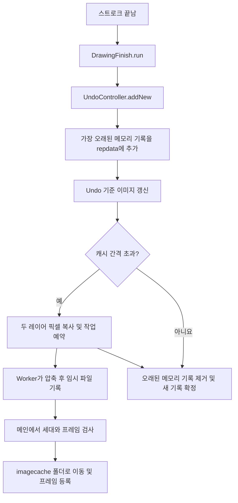

# worker-test 변경 사항 리뷰 — 사용자 설명용

검토 대상은 `8c6ad2c26df70bdae4ba5aa74fb96950fc934a11` **커밋 자체를 포함하여**, 로컬 `worker-test`의 최신 커밋 `f373b6d09f87cf0ab1a9e91016e7b6de2740f333`까지입니다. 총 6개 커밋, 42개 변경 파일을 확인했습니다. 검토일은 2026-09-28~29이며, 아래 줄 번호는 `f373b6d` 기준입니다.

**파일 작업이 실패하는 조건에서 확인한 문제는 3건입니다.** 정상 권한에서 항상 잘못 동작한다는 뜻은 아닙니다. 같은 코드를 정상 조건에서도 실행해 비교했고, 방어 코드로 설명되거나 실제 실패 경로를 확인하지 못한 의심 사항은 문제 목록에서 제외했습니다.

| 번호 | 중요도 | 확인한 문제 | 발생 조건 |
|---|---|---|---|
| R1 | P1: 먼저 수정 | 캐시 준비 실패가 Undo 기록 정리를 중단함 | 기존 기록 파일은 쓸 수 있지만 임시 폴더를 만들 수 없음 |
| R2 | P2: 조건부 기능 오류 | 실제 파일이 없는 캐시를 목록에 등록함 | 이번 Windows/AIR 환경에서 목적 폴더 권한 때문에 파일 이동이 완료되지 않음 |
| R3 | P2: 조건부 성능 저하 | 실패한 캐시를 다음 기록마다 다시 복사·압축함 | Worker의 캐시 파일 쓰기 실패가 지속됨 |

앱 소스와 배포 바이너리는 수정하지 않았습니다. 이 문서의 코드는 **수정 방향을 보여 주는 예시**이며, 프로젝트에 적용하거나 수정 후 회귀 검증을 완료한 패치가 아닙니다. AI가 바로 이어서 검토할 기술 기록은 [AI용 리뷰](E:/fofopaint-source/docs/gpt6astra-review-ai.md)에 있습니다.

## 1. 이번 변경의 핵심 구조

이번 변경은 크게 다음과 같습니다.

| 커밋 | 변경 내용 | 검토 결과 |
|---|---|---|
| `8c6ad2c` | 사용하지 않는 private 코드 정리 | 새로 끊어진 호출 경로를 입증하지 못함 |
| `eef60a4` | 사이드바 스크롤 후 남아 있는 힌트 강조 제거 | 변경 조건과 hide 경로가 일치 |
| `8ba0361` | 캐시 압축·파일 쓰기를 Worker로 이동, 작업 번호/세대 도입, 메뉴 지연 제거 | R1~R3의 핵심 변경 |
| `5d6d726` | 캐시 프레임 간격 10000 복원 | 시작 커밋 이전도 10000이므로 최종 차이 기준 간격 회귀로 보지 않음 |
| `02dedec` | 픽셀 복원 보정표 도입 | 색 보존 정상, AS3 연산 비용 확인 |
| `f373b6d` | 픽셀 복원 ANE 추가 및 Worker 갱신 | Windows x86/x64 정상 복원, Worker는 AS3 경로 |

문제를 이해하는 데 필요한 개념은 다섯 가지입니다.

| 용어 | 여기서의 의미 |
|---|---|
| 메인 스레드 | 마우스 입력과 화면 갱신을 처리하는 실행 흐름 |
| Worker | 압축처럼 오래 걸리는 작업을 맡는 별도 실행 흐름 |
| `repdata` | 그림을 다시 재생할 수 있도록 그리기 명령을 저장하는 파일 |
| 캐시 이미지 | 특정 프레임의 그림을 미리 저장해 두어 탐색을 빠르게 하는 보조 자료 |
| 세대 번호(generation) | Deep Undo 등으로 기록의 흐름이 바뀌었을 때 이전 작업 결과를 구분하는 번호 |

`repdata`는 다시 그릴 수 있는 원본 기록이고, 캐시 이미지는 그 기록에서 다시 만들 수 있는 보조 자료입니다. 따라서 캐시를 만들지 못하더라도 원본 기록의 정리는 끝낼 수 있어야 합니다.

또한 코드의 “프레임”은 여기서 명령 수를 세는 기준으로 사용됩니다. `10000`은 1만 번의 마우스 클릭이나 영상 1만 프레임과 같은 뜻이 아닙니다.

정상적인 기록/캐시 흐름은 다음과 같습니다.



R1은 `G`에서 예외가 나서 `K`에 도달하지 못하는 문제입니다. R2는 `J`에서 파일과 목록이 불일치하는 문제입니다. R3는 캐시 실패 후 `G`를 너무 자주 반복하는 문제입니다.

## 2. R1 — 임시 폴더 생성 실패가 Undo 기록을 중간 상태로 남김

### 어느 코드가 문제인가

| 파일/함수 | 줄 | 의미 |
|---|---:|---|
| [UndoController.addNew](E:/fofopaint-source/src/Modules/UndoController.as:114) | 134–141 | 오래된 기록을 파일에 쓰고 파일 프레임 수와 기준 이미지를 갱신 |
| 같은 함수 | 151–161 | 캐시 이미지 작업 요청 |
| 같은 함수 | 166–179 | 파일로 옮긴 기록을 메모리에서 제거하고 현재 입력을 기록에 추가 |
| [BackgroundWorkerCoordinator.startCacheImageWorker](E:/fofopaint-source/src/Modules/BackgroundWorkerCoordinator.as:319) | 330–335 | 큐를 빈 배열로 만든 뒤 임시 폴더 초기화 |
| [BackgroundWorkerCoordinator.resetCacheTempFolder](E:/fofopaint-source/src/Modules/BackgroundWorkerCoordinator.as:391) | 395–407 | 삭제 오류는 잡지만 폴더 생성 오류는 함수 밖으로 전달 |

관련 부분을 짧게 줄이면 다음과 같습니다.

```actionscript
// UndoController.addNew()의 실제 순서 요약
fs.writeObject(oldData);                    // 135행: 파일에는 이미 들어감
ReplayState.increaseRFileDataTotalFrame(...);// 139행
ReplayDrawer.updateReplayCanvasFromUndoBaseInfo(); // 141행

BackgroundWorkerCoordinator.startCacheImageWorker(...); // 151행

ReplayState.rMemoryData.shift();            // 168행: 위에서 예외가 나면 미실행
// ... 현재 입력 버퍼를 새 기록으로 확정하는 부분도 미실행
```

위 코드는 순서를 설명하는 축약 코드라 `...`가 들어 있습니다. 그대로 컴파일할 코드는 아닙니다.

캐시 요청 안에는 다음 코드가 있습니다.

```actionscript
// BackgroundWorkerCoordinator.as 330–335행
if (undoDataQueue === null)
{
    undoDataQueue = [];
    resetCacheTempFolder();
}
```

`resetCacheTempFolder()` 마지막의 `folder.createDirectory()`는 기존 `try/catch` 밖에 있습니다. 이 호출이 실패하면 캐시 요청뿐 아니라 그 함수를 부른 `UndoController.addNew()`도 바로 중단됩니다.

### 사용자 동작에서 여기까지 도달하는 경로

1. 사용자가 펜 스트로크를 끝냅니다.
2. [PenTool.onMouseUpPenTool():371](E:/fofopaint-source/src/Modules/Tools/PenTool.as:371)이 실행되고 416행에서 `DrawingFinish.run()`을 부릅니다.
3. [DrawingFinish.run():94](E:/fofopaint-source/src/Modules/DrawingFinish.as:94)가 `UndoController.addNew()`를 부릅니다.
4. 최근 기록이 10묶음 이상이면 가장 오래된 묶음을 `repdata`에 추가합니다.
5. 마지막 캐시와의 프레임 차가 10000을 초과하면 캐시를 요청합니다.
6. 이때 임시 폴더 생성이 실패하면 메모리 기록 제거와 새 기록 확정으로 돌아오지 못합니다.

### 실제로 확인한 조건과 결과

별도 테스트 폴더에서 기존 `repdata` 파일을 쓸 수 있게 두고, 부모 폴더의 **하위 폴더 생성 권한만** 거부했습니다. 정상 앱 데이터 폴더의 권한은 변경하지 않았습니다.

원본 `UndoController`와 `BackgroundWorkerCoordinator`를 사용한 실행에서 다음 결과가 나왔습니다.

```text
ADD_ERROR id=3003
  resetCacheTempFolder → startCacheImageWorker → addNew

fileFrames=10001
memoryGroups=10
sameOldest=true
buffer=1
queueIsNull=false
queueLength=0

DISK records=2 frames=10001 oldestStillInMemory=1
```

읽는 방법은 다음과 같습니다.

- `fileFrames=10001`: 오래된 명령을 파일에 쓰고 프레임 수까지 올렸습니다.
- `sameOldest=true`: 그런데 방금 파일로 보낸 명령이 아직 메모리의 첫 원소입니다.
- `buffer=1`: 현재 새 명령도 확정되지 않은 버퍼에 남아 있습니다.
- `queueLength=0`, `queueIsNull=false`: 캐시 작업은 하나도 없지만 큐 상태는 `null`이 아니라 `[]`입니다.

따라서 다음 `addNew()`가 같은 첫 원소를 다시 파일에 넣을 수 있습니다. **중복 직전의 상태는 실행으로 확인했고, 다음 호출에서 다시 append하는 것은 소스 순서로 확인했습니다.** 실제 앱 창에서 후속 스트로크까지 자동 조작한 검증은 아닙니다.

캐시라는 보조 기능의 실패가 원본 Undo 기록의 일관성을 깨뜨리므로 우선 수정 대상으로 보았습니다. 메인 앱의 전역 오류 처리는 로그와 힌트를 남기지만, 중간에 중단된 기록 이관을 복구하지는 않습니다.

### 정상적으로 동작할 조건도 확인했는가

확인했습니다. 임시 폴더 생성이 성공하면 이 예외는 없습니다. Worker 안에서 파일 쓰기가 실패하는 경우에도 새 코드는 오류 응답을 돌려주므로 R1처럼 `addNew()`를 중간에서 끊지 않습니다.

문제는 **Worker에 보내기 전 메인에서 폴더를 준비하는 단계**에 한정됩니다. “Worker에 catch가 있으니 안전하다”는 반증은 이 단계에 적용되지 않습니다.

### 어떻게 보완하면 좋은가

최소한 폴더 준비를 성공시킨 뒤 큐를 만들고, 실패 시 캐시 요청만 건너뛰어야 합니다. 다음은 현재 `startCacheImageWorker()`에 넣을 수 있는 구조 예시입니다.

```actionscript
// BackgroundWorkerCoordinator에 추가하는 helper.
private static function prepareCacheFolderForJob():Boolean
{
    if (undoDataQueue !== null)
        return true; // 다른 작업이 쓰는 폴더는 초기화하지 않음

    try
    {
        resetCacheTempFolder();
        return true;
    }
    catch (error:Error)
    {
        trace("Cache directory unavailable: " + error);
        // R3 보완 시 여기서 현재 세대의 실패 시각도 기록.
        return false;
    }
}

// startCacheImageWorker() 시작 부분에 배치.
// 이 위치는 두 레이어 픽셀을 복사하기 전이어야 함.
if (!prepareCacheFolderForJob())
    return; // 호출한 addNew()는 계속 진행할 수 있음

// 기존 rect 생성, ByteArray 생성, copyPixelsToByteArray 실행.

// 기존 330–335행을 아래처럼 변경.
// 여기서는 resetCacheTempFolder()를 다시 호출하지 않음.
if (undoDataQueue === null)
    undoDataQueue = [];

// 이후 기존 jobId 생성, 큐 등록, Worker 전송을 유지.
```

이 예시는 확인된 **폴더 생성 예외**의 전파를 막습니다. 메모리 부족이나 전송 중 오류까지 모두 해결하는 완성 코드라는 뜻은 아닙니다. 더 구조적으로는 원본 기록의 이관을 끝낸 뒤 선택적인 캐시 작업을 예약하도록 경계를 정리하는 편이 좋습니다.

`addNew()` 전체를 `try/catch`로 감싸고 실패 시 그냥 반환하는 방식은 권하지 않습니다. 이미 파일에 기록한 사실은 그대로 남기 때문입니다.

수정 후에는 다음을 확인해야 합니다.

1. 같은 권한 오류에서 기존 기록은 정확히 한 번만 파일로 이동합니다.
2. 메모리 첫 원소가 제거되고 새 입력 버퍼가 정상 확정됩니다.
3. 실제 작업이 없으면 큐는 `null`입니다.
4. 권한을 복구하면 이후 캐시를 만들 수 있습니다.

## 3. R2 — 캐시 목록에는 있는데 실제 파일은 없는 상태

### 어느 코드가 문제인가

[ReplayFileCache.commitCacheImage():275](E:/fofopaint-source/src/Modules/ReplayEngine/ReplayFileCache.as:275)의 285–296행입니다.

```actionscript
try
{
    tempFile.moveTo(
        FileManager.replayCacheImageFolderPath.resolvePath(
            String(rJumpImageFrameData.length)), true);
}
catch (error:Error)
{
    trace("Cache image commit failed: " + error);
    return false;
}

rJumpImageFrameData.push(metadata.nowFrame);
return true;
```

이 코드는 “`moveTo()`가 예외를 던지지 않고 돌아왔다면 파일 이동도 성공했다”고 판단합니다.

**공식 문서 기준으로는 근거가 있는 판단입니다.** [AIR의 File.moveTo 문서](https://airsdk.dev/reference/actionscript/3.0/flash/filesystem/File.html#moveTo())는 이동 실패 시 예외가 발생한다고 설명합니다. 따라서 코드를 읽기만 했다면 이 `catch`를 잘못된 처리로 단정할 수 없습니다.

그러나 이번 Windows/AIR SDK 51.3.4의 권한 제한 실험에서는 실제 파일이 이동되지 않았는데도 `catch`로 들어가지 않는 결과가 나왔습니다. 이 항목은 **그 환경에서 재현한 파일/인덱스 불일치**를 다룹니다. 다른 OS·SDK도 항상 이렇게 동작한다고 주장하지 않습니다.

### 호출 경로와 관찰한 결과

```text
UndoController.addNew
  → BackgroundWorkerCoordinator.startCacheImageWorker
  → Worker.writeCacheImage
      imagecache_tmp/1.tmp 저장 성공
  → onFromWorker
  → finishCacheImageJob
  → ReplayFileCache.commitCacheImage
      imagecache/1로 이동 시도
      프레임 목록에 10001 추가
```

호출 지점: [onFromWorker():103](E:/fofopaint-source/src/Modules/BackgroundWorkerCoordinator.as:103), [finishCacheImageJob():379](E:/fofopaint-source/src/Modules/BackgroundWorkerCoordinator.as:379), [commitCacheImage():287](E:/fofopaint-source/src/Modules/ReplayEngine/ReplayFileCache.as:287).

목적 폴더인 `imagecache`의 파일 생성 권한을 거부했을 때 다음을 확인했습니다.

```text
cache image job 1: done
COMPLETED last=10001 total=10001
          destinationExists=false tempExists=true
LOAD_CACHE_ERROR 3003
```

여기서 Worker의 `done`은 **임시 파일 쓰기 완료**라는 뜻입니다. 최종 캐시 폴더로 이동까지 끝났다는 뜻은 아닙니다.

- `last=10001`: 앱은 10001 프레임의 캐시가 있다고 생각합니다.
- `destinationExists=false`: 실제 최종 파일은 없습니다.
- `tempExists=true`: 임시 파일은 그대로 있습니다.

정상 권한 대조군에서는 반대로 `destinationExists=true`, `tempExists=false`였고 캐시 읽기도 성공했습니다.

### 사용자에게 어떤 문제가 생기는가

사용자가 해당 구간으로 리플레이를 탐색할 때 다음 경로로 이어집니다.

```text
ReplayDrawer.renderReplayFrame() 284행
  → drawCacheImageFirst() 152행: 프레임 목록으로 캐시 번호 선택
  → drawCacheImageFirst() 197행: 선택한 캐시 읽기
  → ReplayFileCache.loadReplayCacheImage() 136행: FileStream.open
  → 실제 파일이 없어서 실패
```

출처: [ReplayDrawer.as:284](E:/fofopaint-source/src/Modules/ReplayEngine/ReplayDrawer.as:284), [ReplayDrawer.as:150](E:/fofopaint-source/src/Modules/ReplayEngine/ReplayDrawer.as:150), [ReplayFileCache.as:132](E:/fofopaint-source/src/Modules/ReplayEngine/ReplayFileCache.as:132).

확인된 것은 캐시 탐색 실패입니다. 이 결과만으로 원본 `repdata`나 그림 전체가 삭제된다고 말할 수는 없습니다.

### 어떻게 보완하면 좋은가

목록을 갱신하기 전에 **작업의 사후조건**, 즉 “이동이 끝났다면 반드시 성립해야 하는 상태”를 확인하면 됩니다. 목적 파일이 존재하고, 크기가 맞고, 원래 임시 경로에는 더 이상 파일이 없어야 합니다.

다음은 현재 함수의 보완 예시입니다. 기존 세대 검사는 호출자인 `finishCacheImageJob()`에 그대로 둡니다.

```actionscript
public static function commitCacheImage(
    tempFile:File, metadata:CacheImageMetaData):Boolean
{
    if (rJumpImageFrameData.length === 0
        || metadata.nowFrame <= rJumpImageFrameData[
            rJumpImageFrameData.length - 1]
        || metadata.nowFrame > ReplayState.getRFileDataTotalFrame())
    {
        return false;
    }

    const destination:File =
        FileManager.replayCacheImageFolderPath.resolvePath(
            String(rJumpImageFrameData.length));

    try
    {
        if (!tempFile.exists || tempFile.isDirectory)
            return false;

        const sourcePath:String = tempFile.nativePath;
        const expectedSize:Number = tempFile.size;
        if (expectedSize <= 0)
            return false;

        tempFile.moveTo(destination, true);

        // API의 반환과 실제 파일 상태를 함께 확인.
        const originalLocation:File = new File(sourcePath);
        if (!destination.exists
            || destination.isDirectory
            || destination.size !== expectedSize
            || originalLocation.exists)
        {
            trace("Cache move did not complete");
            return false;
        }
    }
    catch (error:Error)
    {
        trace("Cache image commit failed: " + error);
        return false;
    }

    // 검증된 파일에 대해서만 프레임을 등록.
    rJumpImageFrameData.push(metadata.nowFrame);
    return true;
}
```

이 크기 검사는 파일 내용 전체의 무결성을 증명하는 해시 검사는 아닙니다. 여기서 확인된 “이동이 안 됐는데 인덱스를 올리는 현상”을 차단하는 목적입니다. 읽기 단계에서도 캐시가 없거나 손상됐으면 이전 정상 캐시와 원본 명령으로 다시 만들 수 있게 하면 복구 능력이 좋아집니다.

실패를 제대로 감지한 뒤 즉시 재시도를 반복하면 R3이 생길 수 있으므로, 다음 항목의 재시도 제한과 함께 보완하는 것이 좋습니다.

## 4. R3 — 캐시 쓰기가 실패하면 다음 기록마다 전체 압축을 반복

### 어느 코드가 문제인가

[UndoController.addNew():147](E:/fofopaint-source/src/Modules/UndoController.as:147)의 조건입니다.

```actionscript
if (ReplayState.getRFileDataTotalFrame()
        - BackgroundWorkerCoordinator.getLastCacheImageFrame()
        > ReplayFileCache.REPLAY_DISK_CACHE_FRAME_INTERVAL)
{
    // 전체 레이어 스냅샷 및 캐시 요청
}
```

`getLastCacheImageFrame()`은 진행 중인 작업이 있으면 그 작업의 프레임을 사용하고, 없으면 마지막 **성공한** 캐시 프레임을 사용합니다. 정상 상태에서는 중복 작업을 막는 좋은 기준입니다.

하지만 실패한 작업은 큐에서 제거되고 실패 시각이나 시도한 프레임을 저장하지 않습니다. 따라서 성공 캐시가 계속 0이면 아래 조건은 계속 참입니다.

```text
첫 시도: 10001 - 0 > 10000 → 요청 → 실패
다음 기록: 10002 - 0 > 10000 → 다시 요청 → 실패
다음 기록: 10003 - 0 > 10000 → 다시 요청 → 실패
```

출처: [getLastCacheImageFrame():300](E:/fofopaint-source/src/Modules/BackgroundWorkerCoordinator.as:300), [finishCacheImageJob():359](E:/fofopaint-source/src/Modules/BackgroundWorkerCoordinator.as:359).

### 실제로 확인한 경로

R1과 구분하기 위해 이번에는 폴더 생성은 허용하고, Worker가 그 폴더 안에 캐시 파일을 만드는 작업을 실패시켰습니다. 기존 원본 기록 파일의 쓰기는 허용했습니다.

```text
ADD attempt=1 total=10001 queued=true
cache image job 1: error:Error #3001
COMPLETED last=0 total=10001

ADD attempt=2 total=10002 queued=true
cache image job 2: error:Error #3001
COMPLETED last=0 total=10002

ADD attempt=3 total=10003 queued=true
cache image job 3: error:Error #3001
COMPLETED last=0 total=10003
```

정상 권한에서는 첫 작업만 예약됐고, 성공 후 두 번째와 세 번째 기록은 `queued=false`였습니다. 따라서 정상 간격 계산 전체를 잘못됐다고 판단한 것이 아닙니다. **오류 응답 후 성공 프레임이 갱신되지 않는 구간**에 재시도 제한이 부족합니다.

Worker는 오류 응답을 정상적으로 보냈고 최종적으로 종료했습니다. Worker가 멈춰서 영원히 답하지 않는 문제로 설명하면 부정확합니다.

### 왜 성능 문제인가

실패할 때에도 파일 open 전에 이미 다음 작업을 합니다.

1. 메인에서 레이어 1 전체 픽셀 복사.
2. 메인에서 레이어 2 전체 픽셀 복사.
3. Worker에서 첫 바이트 배열을 별도 버퍼로 복사하고 압축.
4. Worker에서 두 번째 바이트 배열도 복사하고 압축.
5. 그 후 파일을 열다가 실패.

출처: [startCacheImageWorker():327](E:/fofopaint-source/src/Modules/BackgroundWorkerCoordinator.as:327), [writeCacheImage():92](E:/fofopaint-source/src/worker/BackgroundImageProcessor.as:92), [copyAndCompress():128](E:/fofopaint-source/src/worker/BackgroundImageProcessor.as:128).

2000×2000 캔버스는 레이어 하나당 `2000 × 2000 × 4 = 16,000,000`바이트입니다. 두 레이어면 **시도마다 약 30.5 MiB**의 원본 스냅샷을 메인에서 처리합니다. 여기에 Worker의 임시 복사와 압축 비용이 더해집니다.

이것은 영구 메모리 누수라는 뜻은 아닙니다. 필요 없는 큰 메모리 할당·복사·압축이 자주 반복된다는 뜻입니다. 실제 FPS 저하율이나 사용자가 느끼는 지연 시간까지 측정하지는 않았습니다.

### 어떻게 보완하면 좋은가

성공한 캐시 프레임과 별도로 “최근 실패한 시각”을 관리하면 됩니다. 예를 들어 실패 후 5초 동안은 그림과 Undo 기록은 계속 처리하면서 캐시 요청만 건너뜁니다.

아래는 `BackgroundWorkerCoordinator`에 추가할 수 있는 helper 예시입니다.

```actionscript
import flash.utils.getTimer;

private static const CACHE_RETRY_WAIT_MS:uint = 5000;
private static var hasCacheIoFailure:Boolean = false;
private static var lastCacheIoFailureAt:int = 0;

private static function canAttemptCacheImage():Boolean
{
    if (!hasCacheIoFailure)
        return true;

    // getTimer의 정수 순환도 고려해 경과 시간을 uint로 비교.
    return uint(getTimer() - lastCacheIoFailureAt)
        >= CACHE_RETRY_WAIT_MS;
}

private static function recordCacheIoFailure(
    failedGeneration:int):void
{
    if (failedGeneration !== cacheGeneration)
        return; // 이미 취소된 과거 작업이 새 작업을 늦추지 않도록 함

    hasCacheIoFailure = true;
    lastCacheIoFailureAt = getTimer();
}
```

연결 위치는 다음처럼 잡습니다.

```actionscript
// startCacheImageWorker()의 맨 앞, 픽셀 복사보다 먼저.
if (!canAttemptCacheImage())
    return;

// finishCacheImageJob()에서 해당 job을 찾은 뒤.
if (job !== null && result.indexOf("error:") === 0)
    recordCacheIoFailure(int(job[1]));

// R1의 폴더 준비 catch에서도 같은 helper를 호출.
// recordCacheIoFailure(cacheGeneration);

// 현재 세대의 캐시가 실제로 확정되었을 때:
// hasCacheIoFailure = false;

// cancelPendingCacheImages()로 세대를 바꿀 때도 초기화.
// hasCacheIoFailure = false;
```

위 연결 예시는 함수 전체를 대체하는 코드가 아닙니다. R2의 이동 실패도 제한하려면 `commitCacheImage()`가 반환하는 단순 `false`를 **오래된 프레임 거절**과 **I/O 실패**로 구분해 전달하도록 확장하는 것이 좋습니다. 정상적인 취소를 파일 오류로 취급해서 불필요한 대기 시간을 만들지 않기 위해서입니다.

5초는 예시 정책입니다. 실제 사용 경험에 맞춰 시간을 조절하거나 새 프레임 수 기준을 함께 사용할 수 있습니다. 중요한 것은 실패한 시도마다 즉시 전체 픽셀을 다시 복사하지 않는 것입니다.

### 함께 정리할 수 있는 오류 메시지 문제

[BackgroundImageProcessor.writeCacheImage():118](E:/fofopaint-source/src/worker/BackgroundImageProcessor.as:118)은 파일을 열지 못해도 `finally`에서 `fs.close()`를 호출합니다. 이 때문에 원래 쓰기 실패 대신 닫기 실패인 `#3001`이 보일 수 있습니다. 이번 Worker 쓰기 실패 실험에서도 `#3001`이 반환되었습니다.

다음처럼 실제로 열었을 때만 닫고, 닫기에서 문제가 생겨도 압축 버퍼는 정리되게 만들 수 있습니다.

```actionscript
const fs:FileStream = new FileStream();
var opened:Boolean = false;
try
{
    fs.open(new File(path), FileMode.WRITE);
    opened = true;
    fs.writeObject([compressed1, compressed2, metadata]);
}
finally
{
    try
    {
        if (opened)
            fs.close();
    }
    finally
    {
        compressed1.clear();
        compressed2.clear();
    }
}
```

이 코드는 open 실패 후 불필요한 close를 막습니다. write와 close가 동시에 실패했을 때 최초 오류까지 별도로 보존하려면 두 오류를 각각 저장하는 처리가 추가로 필요합니다. 이 진단 개선은 R3의 보조 사항이며 별도 주요 결함으로 개수를 늘리지 않았습니다.

## 5. 픽셀 복원은 정확성을 확인했고, 성능 비용은 구분해서 봐야 함

새 `PixelRestore`는 투명 픽셀의 RGB 반올림 손실을 보정하기 위한 코드입니다. 이를 기존 `setPixels()`로 무조건 되돌리면 이번 변경이 해결하려던 색 변화 문제가 다시 생길 수 있습니다.

다음 결과는 실제 분리 실행으로 확인했습니다.

- Windows x86 ANE, x64 ANE, ANE 없는 AS3 경로 모두 랜덤 RGBA 비트맵을 20회 저장/복원한 뒤 원본과 같았습니다. `BitmapData.compare()` 결과가 `0`이었습니다.
- 짧은 픽셀 데이터는 성공한 것으로 처리되지 않고 최종적으로 `#2030` 예외가 발생했습니다.
- 배포된 `worker.swf`와 소스에서 새로 빌드한 Worker 모두 같은 캐시 메시지·메타데이터 처리를 수행했습니다.
- 반투명 PNG를 Worker에서 만들고 다시 읽은 비교도 `0`이었습니다.

### 측정한 복원 시간

Windows의 AIR SDK 51.3.4, 2000×2000 BitmapData, 동일색 픽셀, 각 4회 실행 결과입니다. SWF는 `debug=true`로 빌드했고 `adl -nodebug`로 실행했습니다. **표는 복원 함수 자체의 시간**이며 입력 배열 복제와 PNG 압축 시간은 포함하지 않습니다.

| 경로 | 모든 픽셀이 불투명한 경우 | 반투명 픽셀인 경우 |
|---|---:|---:|
| 기존 `setPixels()` / x86 | 4~5ms | 10~11ms |
| AS3 `PixelRestore` / x86 | 17~19ms | 48~52ms |
| 네이티브 `PixelRestore` / x86 | 2ms | 2~4ms |
| 네이티브 `PixelRestore` / x64 | 2~3ms | 3~5ms |

초기 보정표 생성과 자체 검증은 이 실험에서 약 22~26ms였습니다. 한 컴퓨터의 제한된 조건에서 측정한 값이므로 macOS, 실제 복잡한 그림, 제품 release 빌드의 성능으로 일반화하면 안 됩니다.

메인에서 네이티브 경로를 쓰더라도 **Worker의 PNG 저장/캡처는 AS3 경로**였습니다. Worker에 해당 ANE 클래스가 없기 때문이며, 실제 배포 Worker 로그에서도 `PixelRestore: actionscript`를 확인했습니다. 근거는 [BackgroundImageProcessor.encodePNG():45](E:/fofopaint-source/src/worker/BackgroundImageProcessor.as:45), [PixelRestore.initializeNative():155](E:/fofopaint-source/src/Modules/PixelRestore.as:155)입니다.

이 추가 비용은 색 보존을 위한 의도된 연산이므로 확정 결함 3건에 포함하지 않았습니다. 다만 성능을 더 줄이려면 **입력이 완전히 불투명하다는 사실을 호출자가 보장하는 경우**에 한해 보정을 생략할 수 있습니다.

```actionscript
// 개념 예시: 픽셀 복사와 같은 시점의 정보를 요청에 담아 전달.
// 픽셀을 한 번 더 전부 검사해서 계산하면 검사 비용도 생김.
if (request.pixelsKnownOpaque)
{
    bmpd2.setPixels(rect, ba);
}
else
{
    PixelRestore.setPixels(bmpd2, rect, ba);
}
```

`request`와 `pixelsKnownOpaque`는 현재 코드에 없는 제안 구조입니다. 요청 프로토콜을 바꾸는 경우 메인 송신 코드와 Worker 수신 코드를 함께 바꿔야 합니다. “배경을 넣는 PNG 저장”이라는 이유만으로 입력 레이어가 모두 불투명하다고 가정하면 안 됩니다. 특히 투명 캡처에는 일반 복원 경로를 유지해야 합니다.

## 6. 의심했지만 문제 목록에서 제외한 부분

| 처음 의심한 내용 | 반증 결과 |
|---|---|
| 메인이 공유 픽셀 배열을 먼저 지워 Worker 데이터가 사라짐 | 메인은 배열을 clear하지 않고 참조만 놓습니다. Worker가 복사 후 clear하며 실제 전달 픽셀이 같았습니다. |
| 공유 ByteArray를 직접 압축해 예외 발생 | `copyAndCompress()`가 비공유 배열을 만든 뒤 압축합니다. |
| 취소한 과거 캐시가 나중에 다시 등록됨 | Worker와 메인이 각각 세대 번호를 검사합니다. 취소 응답도 확인했습니다. 모든 타이밍의 스트레스 테스트까지 한 것은 아닙니다. |
| Worker의 metadata 클래스가 달라 캐시 읽기 실패 | alias와 필드 구조가 일치합니다. Worker가 쓴 파일을 main의 `CacheImageMetaData`로 읽어 프레임·바이트 위치·커서를 확인했습니다. |
| 네이티브 코드에 바로 버퍼 초과 읽기가 있음 | 음수 offset 검사와 64비트 필요 길이 검사가 있고, 짧은 입력 실행도 실패로 처리됐습니다. 새로운 메모리 손상 취약점을 입증하지 못했습니다. |
| native 클래스가 없으면 앱이 무조건 중단됨 | 클래스 검색 실패를 catch하고 AS3로 복원합니다. ANE 없이 실행하는 대조군도 통과했습니다. |
| AS3 보정이 원본 바이트 배열을 바꿔 현재 호출자가 반드시 손상됨 | 현재 호출은 소비용 버퍼를 사용합니다. 같은 원본을 재사용해 잘못 복원하는 실제 호출 경로를 찾지 못했습니다. |
| domainMemory 교체가 libwebp를 반드시 망가뜨림 | 이전 메모리를 저장하고 finally에서 돌려놓습니다. 이것만으로 새 결함이라고 할 수 없습니다. |
| 메뉴 지연 삭제 때문에 닫기 처리가 사라짐 | 도구 메뉴의 마우스 up 리스너 연결은 유지됩니다. 즉시 열림은 명시된 변경 의도입니다. |
| 삭제한 private 코드가 실제 기능을 제거함 | 변경된 선언과 호출 참조를 확인하고 Main/Worker를 컴파일했습니다. 새로 끊어진 경로를 확인하지 못했습니다. |

“취약점을 찾지 못했다”는 말은 모든 입력에 안전하다는 인증은 아닙니다. 새 C 코드의 길이·offset·행 간격 검사와 Worker 경로 전달을 확인한 범위에서는, 임의 코드 실행이나 외부 파일 경로 조작으로 이어지는 새 취약점을 입증하지 못했습니다.

## 7. 검증 범위와 다음 수정 순서

Main과 Worker 소스는 AIR SDK 51.3.4에서 strict/warnings 옵션으로 새로 컴파일했고, 두 제품 빌드 모두 오류·경고가 없었습니다. 배포 SWF를 덮어쓰지 않고 테스트 폴더에 출력했습니다.

분리 실행은 원본 캐시·Undo 로직을 사용하되 전체 앱 초기화는 생략했습니다. 샌드박스에서 사용자 앱 저장소 경로 생성이 막혀, 테스트 전용 사본의 `FileManager.appUpTimePath`와 `AppUpdater.updateFilePath` 초기화 경로만 테스트 앱 폴더로 돌렸습니다. 테스트 파일과 로그는 [검증 폴더](E:/fofopaint-source/test-output/gpt6astra-range-review)에 있습니다. 이 폴더는 Git에서 제외되어 있으므로 문서만 복사하면 함께 전달되지는 않습니다.

테스트 폴더의 권한은 실험 후 복원했습니다. 실제 사용자 저장 데이터는 사용하지 않았습니다. 제품의 전체 UI, macOS/Linux 실행, 정식 패키지 설치·업데이트, C 소스 재빌드, 모든 경쟁 타이밍의 스트레스 테스트는 하지 않았습니다.

권장 수정 순서는 다음과 같습니다.

1. **R1:** 캐시 준비 실패가 Undo 이관을 중단하지 않게 합니다. 중복 기록이 생기지 않는지 먼저 확인합니다.
2. **R2:** 파일 이동 결과를 실제 파일 상태로 확인한 후에만 캐시 프레임을 등록합니다. 정상/권한 실패 대조를 함께 실행합니다.
3. **R3:** 캐시 실패 후 재시도를 제한합니다. 권한이 계속 없을 때 입력마다 전체 복사가 반복되지 않고, 권한 복구 후에는 다시 캐시를 만들 수 있어야 합니다.
4. **픽셀 성능:** 색 보존 테스트를 유지한 상태에서만 최적화합니다. 특히 투명 픽셀과 불투명 픽셀, 메인과 Worker 경로를 각각 확인합니다.

정확한 로그와 후속 AI용 수정 조건은 [AI용 리뷰](E:/fofopaint-source/docs/gpt6astra-review-ai.md)에 정리했습니다.
